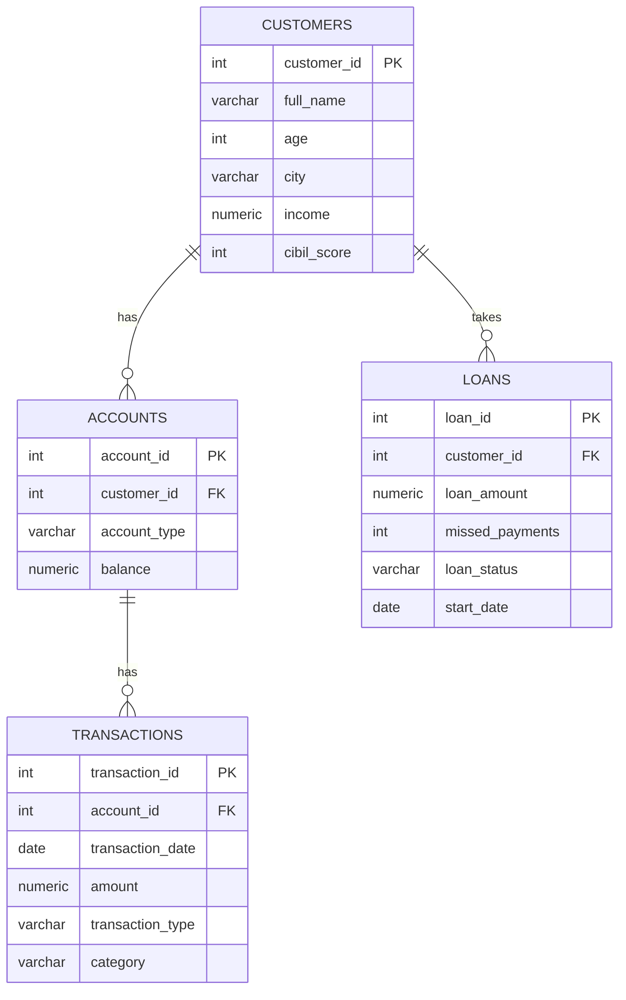

# Retail Bank SQL Project (PostgreSQL)

I made this project to practise SQL on something close to real banking data. There are four tables (customers, accounts, transactions, loans) and eight queries that answer questions a bank would actually ask, like who is risky to lend to, where the bad loans are and which big accounts are lying idle.

The data is made up. I fixed the analysis date at 30 Sep 2026 so the results are always the same when you run it.

## Files

| File | What is inside |
|---|---|
| `bank_setup.sql` | creates the 4 tables, one index, and inserts 76 rows (12 customers, 15 accounts, 38 transactions, 11 loans) |
| `bank_queries.sql` | 8 queries grouped by topic |
| `bank_practice_commands.sql` | CREATE, ALTER, UPDATE, DELETE and ROLLBACK practice on a copy of the customers table |

## Tables

A customer can have more than one account and more than one loan. Every account can have many transactions.

## What each query does

| Query | Question | Topic |
|---|---|---|
| Q1 | Which customers in Mumbai or Pune have a CIBIL score of 700 or more? | WHERE, AND, OR |
| Q2 | Which spending categories cross 40,000 in withdrawals? | GROUP BY, HAVING |
| Q3 | Which customers have no loan? | EXCEPT |
| Q4 | What is the risk label (Low, Medium, High) of each customer? | CASE, COALESCE, view |
| Q5 | Which income bands have the most defaulted loans? | CTE, CASE |
| Q6 | How much money does each customer hold in total? | INNER JOIN |
| Q7 | Which customers have no loan (second method)? | LEFT JOIN |
| Q8 | Which big accounts have had no activity for 90 days? | subquery, NOT EXISTS |

## What I found

- Only 3 customers from Mumbai or Pune have a CIBIL score of 700 or more (Aarav Sharma, Priya Nair and Rohan Mehta).
- Only three spending categories cross 40,000 in withdrawals: Investment (1.73 lakh), Travel (1.64 lakh) and Electronics (47,700).
- Neha Gupta is the only customer with no loan, so she is an easy person to offer one to.
- Risk labels came out as 5 High, 3 Medium and 4 Low. All four customers with a defaulted loan are High.
- Bad loans are mostly with lower incomes. In the Below 5 lakh band about 72% of the money lent has defaulted, in the 5 to 10 lakh band about 36%, and nothing above 10 lakh. For the whole loan book it is about 13.9% (20.5 lakh out of 1.475 crore).
- Rohan Mehta has the highest total balance, about 18.9 lakh in two accounts.
- Three accounts hold about 9.3 lakh together and have had no transaction since 2 Jul 2026 (one has never had any). These are worth a phone call.

## How to run it

1. Create a database in PostgreSQL, I called mine `retail_bank_project`.
2. Open the Query Tool on that database and run `bank_setup.sql`. The last output should show 12, 15, 38 and 11.
3. Run `bank_queries.sql` one query at a time (select it, press F5). In Q4 run Part A first because it creates the view.
4. Run `bank_practice_commands.sql` step by step if you want to see how ALTER, UPDATE and DELETE behave. It only touches a copy table.

## Things I want to add later

- window functions like RANK and running totals
- a debt to income ratio for each customer
- a dashboard on top of these queries in Power BI or Excel
